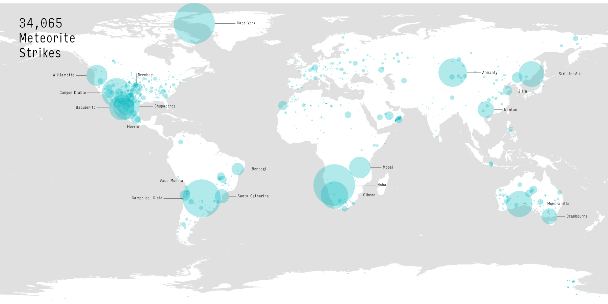
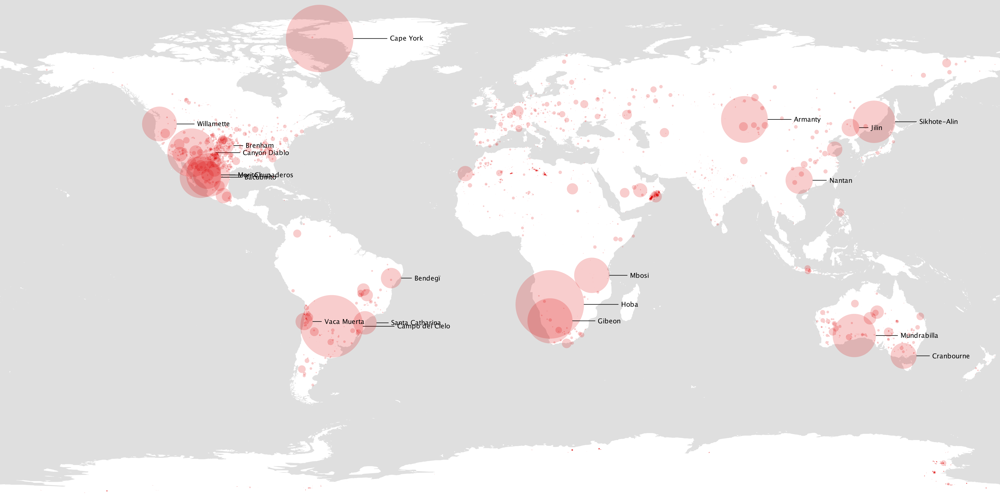

# Meteorite Strike Visualization

A visualization of 34,065 meteorite strikes, scaled to the relative size of the meteorite. The largest meteorites are labeled.

(Click through twice for larger)

Based on the tutorial [here](https://www.skillshare.com/classes/Designing-Data-Visualizations-Getting-Started-with-Processing/1063775924). You may be able to sign up for a free trial to access this tutorial.

The data, found in [meteors.csv](./meteors.csv), comes from [The Meteoritical Society](https://www.lpi.usra.edu).

## Instructions

To run, load Meteors.pde files in [Processing](https://processing.org/). Click the run button. Your output, saved in meteorStrikes.pdf, should look like this:

(Click through twice for larger)

### Important Notes:
* You may need to switch to a different font if your system doesn't have Avenir.
* This was only tested in Processing 3.

## Post-processing

After some post-processing in a vector editing program, you can transform the image to look like this:

(Click through twice for larger)

Some popular vector editors:
* [Adobe Illustrator](http://www.adobe.com/products/illustrator.html)
* [Inkscape](https://inkscape.org/en/)
* [Affinity Designer](https://affinity.serif.com/en-us/designer/) (I used this for this project)
* [Sketch](https://www.sketchapp.com/)